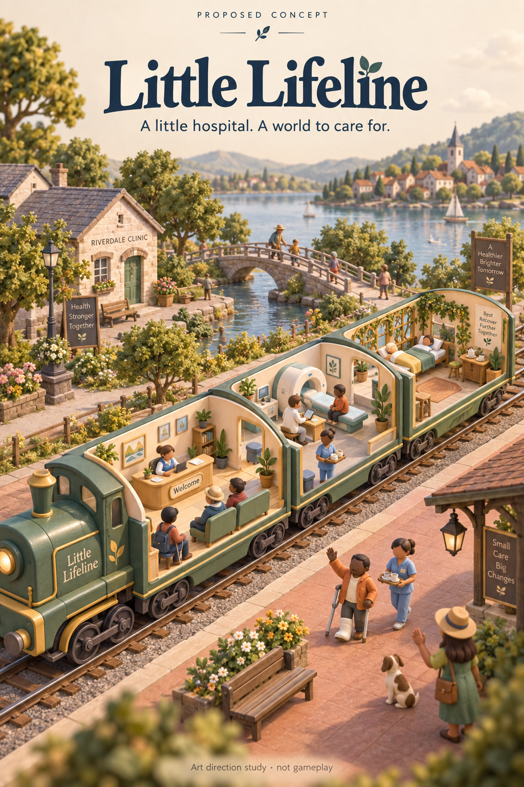

# Little Lifeline — a hospital on rails

Selected game concept, 11 September 2026. The user chose the hospital-on-rails setting after reviewing the concept image. Unity only. This direction replaces the Orbit Orchard arcade proposal; it is a design hypothesis, not a tested claim of fun or retention. The working title has not had trademark clearance.

## The promise

Build a little travelling hospital that makes the places it visits feel alive again. Begin with a shabby locomotive, one treatment carriage and a small crew. Arrange the train, care for residents, fund visible town improvements and discover the next stop. Your staff keep the clinic running while you are away.

The player manages space, staff and patient flow. Clinical diagnoses are automatic, fictionalised and non-instructional. There are no deaths, paid rescue prompts or penalties for missing a day. The pleasure should come from understanding a small system, making it work better, watching charming people do their jobs and leaving somewhere better than you found it.

## What the research changes

This is a desk review of official descriptions, support material and 17 official iPhone screenshots, not hands-on play. Google Play download thresholds checked during this review establish audience scale, not present popularity rank, active users, revenue or proof that an individual feature causes retention.

| Reference | Evidence | Design consequence |
| --- | --- | --- |
| My Perfect Hotel | Google Play lists 100M+ downloads. Its opening loop moves from direct reception/cleaning/stocking to hiring staff. [Official listing](https://play.google.com/store/apps/details?id=com.master.hotelmaster). | Show one complete care journey before teaching automation. A new hire must visibly take over a job. |
| Hospital Empire Tycoon | Google Play lists 1M+ downloads. The developer documents dependencies between reception, doctors, supplies and departments. [Listing](https://play.google.com/store/apps/details?id=com.codigames.idle.hospital.empire.tycoon), [first tips](https://codigames.helpshift.com/hc/en/19-hospital-empire-tycoon/faq/533-how-to-play-hospital-empire-tycoon-first-tips/). | Queues and walking routes must explain the next decision. Show why a room is blocked and how to resolve it. |
| Idle Theme Park Tycoon | Google Play lists 10M+ downloads. Official screenshots make queues, attraction footprints and connecting paths prominent. [Listing](https://play.google.com/store/apps/details?id=com.codigames.idle.theme.park.tycoon). | The 3D scene is the main management interface. Keep paths legible and decoration subordinate to activity. |
| Idle Miner Tycoon | Chrono provides the same unpurchasable time tickets to everyone, but allows owned managers, boosts and research. [Tickets](https://kolibri-games.helpshift.com/hc/en/3-idle-miner-tycoon/faq/340-how-do-i-use-chrono-tickets/), [rules](https://kolibri-games.helpshift.com/hc/en/3-idle-miner-tycoon/faq/338-what-is-the-chrono-mine/). | Equal play time does not establish equal power. Our ranked challenge needs identical staff, rooms and starting resources too. |
| Usagi Shima | Its developer describes visitors, friendship keepsakes, decoration and real-time ambience without time limits. [Press kit](https://usagishima.net/presskit/). | Give people something pleasant to discover on return: a resident's letter, a completed town project or a new carriage detail. |
| Two Point Hospital | Room layout, walking routes, staff specialisation and unusual illnesses are established features of this genre. [Developer page](https://www.twopointstudios.com/en/games/two-point-hospital). | Funny illnesses alone are not our differentiator. The small reconfigurable train and persistent relationships between towns must affect play. |

Further monetization and competition evidence: [economy research](../research/idle-management-economy.md).

## The repeatable loop

1. **Read the next stop.** Its noticeboard shows the expected mix of consultations, diagnostic visits and recovery care. Choose a community project with a visible reward.
2. **Arrange the train.** Four working carriage slots force a tradeoff between throughput, specialist care and comfortable recovery. Frequently connected rooms benefit from being close together. Show the travel-time change before committing a rearrangement.
3. **Give the crew a plan.** Assign a dedicated worker to a busy room or a flexible helper to two compatible rooms. Changes begin after the current task; trying another arrangement is free.
4. **Watch, understand, improve.** Residents arrive, sit, visit treatment stations and depart. A backed-up reception queue or an idle scanner explains the problem. One adjustment should make an observable difference within about 20 seconds.
5. **Leave a mark.** Finishing a town project restores a specific part of the scene: the market, school garden or station clinic. Residents return in later visits and acknowledge what changed.
6. **Return to a working hospital.** Staff continue the current care plan offline. Collect a single accurate report, see the limiting department, and choose the next improvement or destination.

The first version has one earned currency for construction and training, plus permanent town reputation that unlocks contracts. No premium gems or energy meter. Purchases do not fix broken care flow.

## First ten minutes

These are pacing targets for testing, not existing runtime behaviour.

| Time | What happens | Why it matters |
| --- | --- | --- |
| 0–1 minute | Arrive at Willowbank. Welcome a resident, assign the nurse and watch the first complete visit. | Establish purpose, input and reward without a tutorial wall. |
| 1–3 minutes | Spend the first construction grant on a second useful station. A new care pathway appears. | Show a physical improvement and a real capacity decision. |
| 3–5 minutes | Hire an assistant. Move them toward the growing queue and watch residents start moving again. | Make automation and bottleneck management tangible. |
| 5–7 minutes | Complete the first town project. The neglected station garden opens and a resident leaves a keepsake. | Reward the player with a world change, not only a number. |
| 7–10 minutes | Compare two next-stop requests, rearrange a carriage and set the crew's plan. Introduce offline work. | Let the player exercise the full loop before any long wait. |

The game does not require constant treatment tapping. Short optional actions welcome a notable visitor, choose a project or direct a helper; they do not replace management with repetitive hauling.

## Longer progression

- **Willowbank:** learn reception and consultation, restore the station garden.
- **Copperhill:** a different demand mix makes diagnostics and crew travel matter; reopen a community workshop.
- **Seabrook:** longer recovery visits reward another allocation; restore the seaside clinic.
- Keep every carriage, staff improvement, keepsake and completed town project when travelling. Return to familiar places with new requests; do not wipe progress in a prestige reset.
- Give named crew distinct, understandable roles and one useful specialism. Earn them through play rather than random paid boxes.
- Unlock details that show ownership: train paint, room fittings, staff uniforms, destination postcards and a scrapbook of the restored towns.

## Mobile interface and art direction

Use a warm miniature railway aesthetic: seaweed-painted carriages, oat interiors, clay platforms, brushed brass and paper station signs. Pair an expressive editorial serif for place names with a restrained humanist sans for controls. Choose and verify font licences during implementation. UI colour tokens originate in OKLCH and are converted for Unity; use tinted neutrals and measured contrast.

The portrait camera is a high three-quarter cutaway. The train runs along the screen's long diagonal. In overview, show the train and its immediate platform with clear room silhouettes and one priority signal per room. Tap a carriage to focus on it while retaining its neighbours and couplings for orientation. A compact bottom sheet shows the current blocker, crew assignment and one useful improvement. A whole-train button returns to overview. Detailed interiors need not all be readable at five-car overview scale.

Persistent navigation has three labelled destinations: **Hospital**, **Route**, **Crew**. The weekly noticeboard lives on the route screen; optional purchases live in the wardrobe/depot. The centre stays available for the living world. Do not place offer timers or purchase badges along both sides of the scene.

Room selection must also work through labelled controls for accessibility. Use large touch targets, safe-area-aware layout, legible small-screen text, haptics that can be disabled and reduced-motion support. Camera transitions and physical work animations should communicate state; reduced motion removes camera sweeps and particle flourishes while preserving information.

## Competition that fits the game

**The Weekly Call** is an optional four-minute station shift. Everyone receives the same train capacity, crew, room choices, patient arrivals and construction budget. It uses a fixed amount of simulated time and permits planning pauses. Replays improve the best result rather than accumulate points through grinding. Main-campaign upgrades, purchases, offline income and ads have no effect.

Rank completed care plans first and total patient waiting time second, within the same challenge rules version. Show an understandable score breakdown and the player's real Game Center result. Start with friends and the weekly global board. Never invent rivals or fill empty boards with fake scores. Do not sell extra ranked attempts.

A native recurring Game Center board is appropriate for casual competition. Local score validation does not provide server-authoritative anti-cheat. Valuable prizes, enforced attempts or stronger competitive integrity would require a trusted backend. Scores queued offline retain their original week and must not leak into the next occurrence. [Apple leaderboard guidance](https://developer.apple.com/help/app-store-connect/configure-game-center/manage-leaderboards).

## Monetization

The first paid product is a permanent **Founder's Carriage Collection**: previewable train finishes, matching room furnishings and crew outfits. It has no income, speed or leaderboard bonus. Preserve the existing verified Plus entitlement as ownership of equivalent cosmetic value. Keep optional tips and restore purchases. Use App Store prices returned by StoreKit; do not hardcode a currency or pretend an unavailable product can be bought.

The first release does not depend on an ad network. Later authored route expansions could be sold when there is enough content to justify them. No forced ads, subscriptions, paid emergencies or random paid staff are planned. This is a product choice to test, not a claim that cosmetic sales will sustain the business.

## First playable and release requirements

### P0 — prove the game

- One complete town with at least two materially different viable allocations, visible queues, crew travel, three care pathways and a visible project completion.
- The player can build, assign, rearrange, save, quit and return to an accurate offline report without duplicating rewards.
- The same deterministic simulation drives foreground and offline work. Bound queues and catch-up time; time reversal grants no reward. Absence does not create debt or an emergency backlog.
- Actual Unity iPhone-format play inspection proves direct room input, navigation, room readability, pause/resume and persistent state. Source compilation is insufficient.
- Observe whether a new player can explain why a queue formed and make it move. If the optimal action is always to buy every upgrade, change the simulation before adding more content.

### P1 — complete the first TestFlight candidate

- Three differentiated towns, four working carriage slots, a small named crew roster, projects, keepsakes and permanent progression.
- Equal-start weekly challenge, real Game Center authentication/submission/loading and clear offline/error states.
- Real StoreKit product loading, purchase, pending/cancelled handling, restoration and verified entitlement effects; legacy purchase preservation.
- Original Blender models optimised for mobile, readable animation, sound, accessibility preferences, privacy manifest and an actual iOS performance pass.
- Fresh Unity device export, signed archive, upload and verification that App Store Connect has processed the new build. Update public beta copy to describe the game actually delivered.

### P2 — earn with evidence

Additional routes, deeper staff relationships, more room types, player visits, co-op town projects and seasonal cosmetic collections. These follow a successful core loop; their supporting network and content work are not assumed to exist.

## What to measure in playtesting

The first evaluation uses observed behaviour rather than invented retention projections: time to the first completed visit; whether the first assignment happens without explanation; whether two different allocations produce understandable tradeoffs; whether a changed assignment visibly helps; whether the player voluntarily starts another stop; and what they expect to find when returning tomorrow. Performance targets and session pacing remain hypotheses until run on an iPhone.

## Evidence boundary and reusable work

The concept image was generated with the built-in imagegen tool for this review and is **art direction, not gameplay**. Its [prompt](little-lifeline-art-direction-prompt.txt) is saved with it. Existing Unity installation, input infrastructure, Apple service bridge and release tooling can be reused. The prior orbit simulation, scores and marketing do not establish readiness for this game and must not be relabelled as hospital results.
